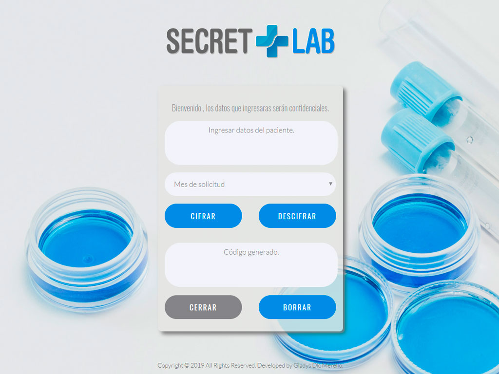
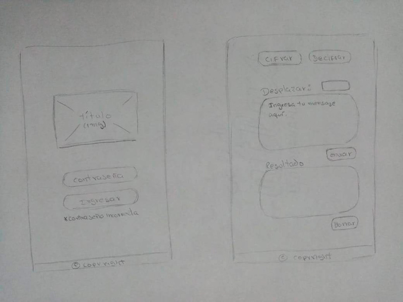
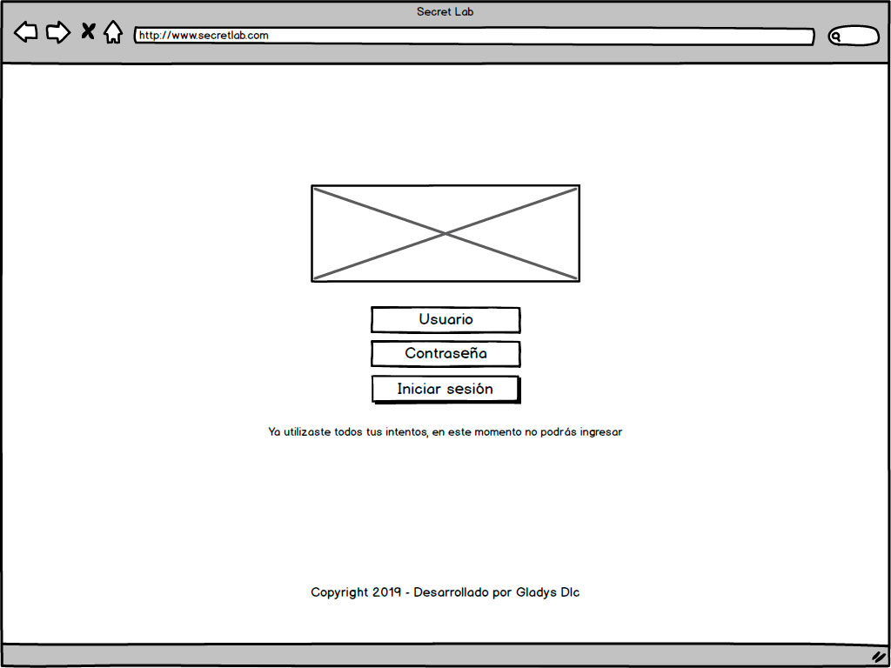
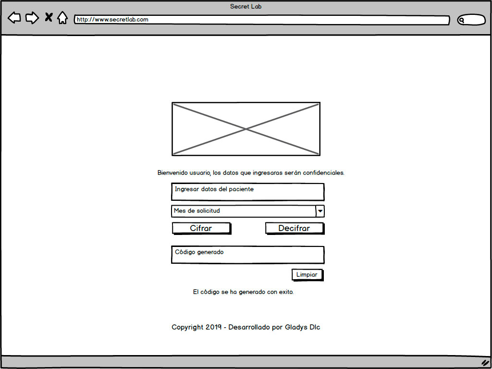

# Secret Lab

## Índice

- [Índice](#índice)
- [Resumen del proyecto](#resumen-del-proyecto)
- [Imagen del proyecto](#imagen-del-proyecto)
- [Investigación UX](#investigacion-ux)
  - [Usuario](#usuario)
  - [Objetivos del proyecto](#objetivos-del-proyecto)
  - [Soluciona los problemas / necesidades del usuario](#soluciona-los-problemas-necesidades-del-usuario)
  - [Prototipo en papel](#prototipo-en-papel)
  - [Feedback](#feedback)
  - [Prototipo en Balsamiq](#prototipo-en-balsamiq)

## Resumen del proyecto

Se realizará una aplicación web que permita cifrar los datos del paciente, para mantener la confidencialidad requerida. También, podrán ser descifrados a través de la misma aplicación. El acceso a esta estará protegida con una pantalla de login que se bloqueara al fallar la contraseña por tercera vez.

## Imagen del proyecto

## Investigación UX

### Usuario

El usuario objetivo es el personal médico que genera la solicitud de la prueba médica, en este caso la prueba de ELISA (VIH).

### Objetivos del proyecto

El objetivo es el de mantener la confidencialidad de los datos del paciente. Solo el solicitante de la prueba debe conocer los datos cifrados.

### Soluciona los problemas / necesidades del usuario

Las pruebas de VIH requieren confidencialidad para proteger la identidad del paciente. Para esto el proyecto nos permitira cifrar los datos.

### Prototipo en papel

### Feedback

En el feedback realizado se indicó:
- Organizar con más detalle la segunda pantalla de cifrar y descifrar para que el usuario pueda identificar mejor el objetivo del proyecto.
- El usuario solicito añadir el botón cerrar para reiniciar la sesión.
- En cuanto al diseño se realizaron unos cambios en el footer respecto al diseño del prototipo.
- Se realizaron pequeñas mejoras de organización de los elementos del formulario.

### Prototipo en Balsamiq

